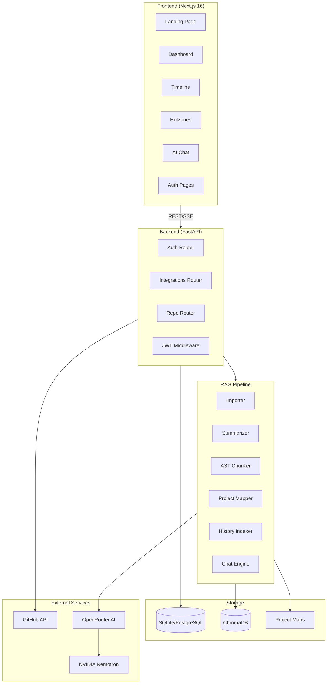

<p align="center">
  
</p>

<h1 align="center">GitStory</h1>

<p align="center">
  <strong>Mine, Index, and Chat with any GitHub Repository</strong>
</p>

<p align="center">
  <a href="#-features"></a>
  <a href="#-tech-stack"></a>
  <a href="LICENSE"></a>
</p>

<p align="center">
  GitStory transforms how you understand codebases. It mines commit history, indexes repository structure using a custom RAG pipeline, and lets you query anything through natural language — all wrapped in a stunning dark-themed dashboard.
</p>

---

## 📋 Table of Contents

- [Features](#-features)
- [Screenshots](#-screenshots)
- [Architecture](#-architecture)
- [Tech Stack](#-tech-stack)
- [Getting Started](#-getting-started)
- [Environment Configuration](#-environment-configuration)
- [API Reference](#-api-reference)
- [RAG Pipeline](#-rag-pipeline)
- [Project Structure](#-project-structure)
- [Contributing](#-contributing)
- [License](#-license)

---

## ✨ Features

### 🏠 Analytics Dashboard
An at-a-glance overview of any GitHub repository — commit frequency, language distribution, code health score, active hotzones, and recent activity. Real data, no mock-ups.

### 💬 AI-Powered Code Chat (RAG Explorer)
Index any repository and chat with its codebase in natural language. Ask about architecture, specific files, commit history, or how components connect. Powered by a custom 3-stage Retrieval-Augmented Generation pipeline with streaming responses (SSE).

### 📊 Timeline Narration
AI-generated narrative history of a project. Visualizes commits as a story — with phases, pivots, refactors, and crises — presented on an interactive vertical timeline.

### 🔥 Structural Hotzones
Interactive D3.js treemap that highlights the most frequently modified files in a repository. Severity-coded (Stable → Critical) with a Global Risk Index and per-file churn statistics.

### 👥 Collaborator Insights
Discover top contributors, their commit counts, PR activity, and impact scores. Auto-generates roles (Lead, Core, Contributor) based on contribution patterns.

### 📈 Repository Statistics
Build stability, health scores, commit frequency heatmaps, language distribution charts, and code churn trends — all pulled live from git history.

### 🔍 AI Code Review
Automated code review on recent commits using Semgrep for static analysis + LLM-powered review. Generates health scores, security findings, complexity analysis, and line-by-line feedback.

### 🔐 Authentication System
Full JWT-based auth with registration, login, token refresh, and GitHub OAuth integration. Secure access to all API endpoints.

---

## 📸 Screenshots

<details>
<summary><strong>Click to expand all screenshots</strong></summary>

| Screen | Preview |
|--------|---------|
| **Dashboard Overview** |  |
| **Activity & Health Score** |  |
| **Collaborators** |  |
| **Structural Hotzones** |  |
| **Timeline Narration** |  |
| **RAG Chat Explorer** |  |
| **Sign Up** |  |
| **Sign In** |  |

</details>

---

## 🏗 Architecture



### Data Flow

1. **User submits a GitHub URL** → Frontend sends it to the backend
2. **Backend clones the repo** and dispatches analysis jobs (timeline, hotzones, stats, collaborators)
3. **RAG Indexing** (on-demand): Imports files → Summarizes with LLM → Chunks with tree-sitter AST → Generates project map → Indexes commit history → Stores everything in ChromaDB
4. **Chat queries** go through a 3-stage retrieval: search summaries → search AST chunks within matched files → search commit history → stream LLM response

---

## 🛠 Tech Stack

### Frontend
| Technology | Purpose |
|---|---|
| **Next.js 16** | React framework with App Router |
| **React 19** | UI library |
| **TypeScript** | Type safety |
| **Tailwind CSS 4** | Utility-first styling |
| **Recharts** | Charts & data visualization |
| **D3.js** | Treemap visualizations (Hotzones) |
| **Framer Motion** | Animations |
| **Lucide React** | Icon system |
| **NextAuth** | Authentication |

### Backend
| Technology | Purpose |
|---|---|
| **FastAPI** | Async Python API framework |
| **SQLAlchemy** | ORM & database management |
| **PyJWT + bcrypt** | JWT authentication |
| **PyGithub** | GitHub API integration |
| **PyDriller** | Git repository mining |
| **Pydantic** | Data validation & settings |

### RAG Pipeline
| Technology | Purpose |
|---|---|
| **ChromaDB** | Vector database for embeddings |
| **tree-sitter-language-pack** | AST parsing for 18+ languages |
| **OpenRouter API** | LLM inference gateway |
| **NVIDIA Nemotron** | Embeddings & chat model (free tier) |
| **Tenacity** | Retry logic for API calls |

### Code Analysis
| Technology | Purpose |
|---|---|
| **Lizard** | Cyclomatic complexity analysis |
| **Semgrep** | Static analysis & security scanning |
| **GitPython** | Git operations |

---

## 🚀 Getting Started

### Prerequisites

- **Python** 3.10+
- **Node.js** 18+
- **Git**
- An **OpenRouter API Key** (free tier available at [openrouter.ai](https://openrouter.ai))
- *(Optional)* GitHub Personal Access Token for private repos

### 1. Clone the Repository

```bash
git clone https://github.com/MSabihkhan/GitStory.git
cd GitStory
```

### 2. Backend Setup

```bash
cd backend

# Create and activate virtual environment (recommended)
python -m venv venv
# Windows
venv\Scripts\activate
# macOS/Linux
source venv/bin/activate

# Install dependencies
pip install -r requirements.txt

# Copy and configure environment
cp .env.example .env
# Edit .env with your settings (see Environment Configuration below)

# Start the server
python -m uvicorn src.main:app --reload --port 8000
```

### 3. Frontend Setup

```bash
cd frontend

# Install dependencies
npm install

# Create environment file
cp .env.local.example .env.local
# Edit .env.local with your settings

# Start dev server
npm run dev
```

### 4. RAG Dependencies (for AI Chat)

```bash
# From project root
pip install -r requirements.txt
```

The app will be available at **[http://localhost:3000](http://localhost:3000)**.

---

## ⚙ Environment Configuration

### Root `.env`

```env
# Backend
DATABASE_URL=sqlite:///./backend/gitstory.db
JWT_SECRET=your-secret-key
JWT_ALGORITHM=HS256
JWT_ACCESS_TOKEN_EXPIRE_MINUTES=30
JWT_REFRESH_TOKEN_EXPIRE_DAYS=7
HOST=0.0.0.0
PORT=8000
FRONTEND_URL=http://localhost:3000

# RAG Paths
RAG_CHROMA_PATH=./RAG/chroma_db
RAG_MAPS_DIR=./RAG/project_maps
RAG_REPOS_DIR=./RAG/repos

# GitHub OAuth (optional)
GITHUB_CLIENT_ID=your-github-client-id
GITHUB_CLIENT_SECRET=your-github-client-secret

# AI/LLM Keys
OPENROUTER_API_KEY=your-openrouter-api-key
```

### Frontend `frontend/.env.local`

```env
NEXT_PUBLIC_API_URL=http://localhost:8000
NEXTAUTH_URL=http://localhost:3000
NEXTAUTH_SECRET=your-nextauth-secret
```

---

## 📡 API Reference

All endpoints are prefixed with `/api` and require JWT authentication unless noted.

### Authentication

| Method | Endpoint | Description |
|--------|----------|-------------|
| `POST` | `/api/auth/register` | Register new user |
| `POST` | `/api/auth/login` | Login (returns JWT) |
| `POST` | `/api/auth/refresh` | Refresh access token |
| `GET` | `/api/auth/me` | Get current user profile |
| `POST` | `/api/auth/logout` | Logout |
| `POST` | `/api/auth/forgot-password` | Request password reset |
| `POST` | `/api/auth/reset-password` | Reset password with token |
| `GET` | `/api/auth/github/login` | Initiate GitHub OAuth |
| `POST` | `/api/auth/github/callback` | Handle GitHub OAuth callback |

### Repositories

| Method | Endpoint | Description |
|--------|----------|-------------|
| `GET` | `/api/repositories` | List saved repositories |
| `GET` | `/api/repositories/github` | Fetch repos from GitHub |
| `POST` | `/api/repositories` | Save a repository |

### Analysis & Integrations

| Method | Endpoint | Description |
|--------|----------|-------------|
| `POST` | `/api/analyze` | Analyze repo metadata (languages, PRs, contributors) |
| `POST` | `/api/index-repo` | Start RAG indexing (background task) |
| `GET` | `/api/index-repo/status/{job_id}` | Poll indexing job status |
| `POST` | `/api/chat` | Chat with indexed repo (SSE streaming) |
| `POST` | `/api/chat/reset` | Reset chat history |
| `GET` | `/api/timeline` | Get timeline narration |
| `GET` | `/api/hotzone` | Get file churn data |
| `GET` | `/api/stats` | Get repository statistics |
| `GET` | `/api/collaborators` | Get contributor data |
| `POST` | `/api/review` | AI code review |

---

## 🧠 RAG Pipeline

GitStory's RAG (Retrieval-Augmented Generation) pipeline is a custom-built system designed for deep codebase understanding.

### Pipeline Stages

```
1. IMPORT       → Clone repo, filter files (skip binaries, node_modules, etc.)
2. SUMMARIZE    → LLM generates 2-3 sentence summaries per file (parallel, 5 workers)
3. AST CHUNK    → tree-sitter parses functions/classes/methods into semantic chunks
4. PROJECT MAP  → LLM synthesizes a global architecture map from all summaries
5. HISTORY      → PyDriller indexes commit diffs into searchable records
6. STORE        → Everything goes into ChromaDB with OpenRouter embeddings
```

### 3-Stage Query Process

```
User Question
    ↓
[1] Search SUMMARIES → identify relevant files
    ↓
[2] Search AST CHUNKS → scoped to matched files only
    ↓
[3] Search COMMIT HISTORY → find related changes
    ↓
[Prompt] Global Map + Code Snippets + History → LLM → Streamed Response
```

### Supported Languages (AST Parsing)

Python · JavaScript · TypeScript · Java · C++ · C · C# · Go · Rust · Ruby · PHP · Swift · Kotlin · Scala · R · Lua

### Models Used

| Model | Purpose |
|---|---|
| `nvidia/nemotron-3-super-120b-a12b:free` | Chat, summarization, project mapping |
| `nvidia/llama-nemotron-embed-vl-1b-v2:free` | Embeddings (ChromaDB) |
| `nvidia/nemotron-3-nano-30b-a3b:free` | Code review |

---

## 📁 Project Structure

```
GitStory/
├── frontend/                    # Next.js 16 App
│   ├── app/
│   │   ├── page.tsx             # Landing page
│   │   ├── login/               # Login page
│   │   ├── signup/              # Registration page
│   │   ├── settings/            # User settings
│   │   └── dashboard/
│   │       ├── page.tsx         # Main dashboard
│   │       ├── chat/            # RAG Chat Explorer
│   │       ├── timeline/        # Timeline narration
│   │       ├── hotzones/        # Structural hotzones
│   │       ├── stats/           # Repository statistics
│   │       └── collaborators/   # Contributor insights
│   ├── components/
│   │   ├── layout/              # DashboardShell, navigation
│   │   ├── ui/                  # Reusable UI components
│   │   ├── Timeline.tsx         # Timeline component
│   │   ├── HotzoneTreemap.tsx   # D3 treemap component
│   │   └── Leaderboard.tsx      # Contributor leaderboard
│   └── lib/
│       ├── api.ts               # API client
│       ├── use-auth.ts          # Auth hook
│       └── design-tokens.ts     # Design system tokens
│
├── backend/                     # FastAPI Unified Backend
│   ├── src/
│   │   ├── main.py              # App entry point
│   │   ├── config/
│   │   │   ├── settings.py      # Pydantic settings
│   │   │   └── database.py      # SQLAlchemy setup
│   │   ├── routes/
│   │   │   ├── auth.py          # Auth endpoints + GitHub OAuth
│   │   │   ├── integrations.py  # Analysis, RAG, timeline, hotzone
│   │   │   └── repositories.py  # Repository CRUD
│   │   ├── controllers/
│   │   │   ├── auth_controller.py
│   │   │   └── repo_controller.py
│   │   ├── models/              # SQLAlchemy models
│   │   │   ├── user.py
│   │   │   ├── repository.py
│   │   │   ├── project.py
│   │   │   └── token.py
│   │   └── middleware/
│   │       └── auth.py          # JWT middleware
│   └── requirements.txt
│
├── RAG/                         # RAG Pipeline Module
│   ├── main.py                  # Pipeline orchestrator
│   ├── rag_config.py            # Model & tuning config
│   ├── core/
│   │   ├── engine.py            # Chat engine (sync + streaming)
│   │   ├── chunker.py           # tree-sitter AST chunking
│   │   ├── summarizer.py        # LLM file summarization
│   │   ├── mapper.py            # Global project map generator
│   │   ├── vector_store.py      # ChromaDB wrapper
│   │   └── file_filter.py       # File filtering rules
│   └── pipelines/
│       ├── importer.py          # Repo cloning & import
│       └── history_indexer.py   # PyDriller commit indexing
│
├── code_review.py               # AI code review (Semgrep + LLM)
├── heatmap.py                   # File churn analysis (PyDriller)
├── timeline.py                  # Commit data extraction
├── narration.py                 # AI narrative generation
├── requirements.txt             # Root Python dependencies
└── .env                         # Environment configuration
```

---

## 🤝 Contributing

Contributions are welcome! Here's how to get started:

1. **Fork** the repository
2. **Create** a feature branch (`git checkout -b feature/amazing-feature`)
3. **Commit** your changes (`git commit -m 'feat: add amazing feature'`)
4. **Push** to the branch (`git push origin feature/amazing-feature`)
5. **Open** a Pull Request

Please ensure your code follows the existing patterns and includes appropriate tests.

---

## 📄 License

This project is licensed under the **MIT License** — see the [LICENSE](LICENSE) file for details.

---

<p align="center">
  Built with ❤️ by <a href="https://github.com/MSabihkhan">Muhammad Sabih ud din khan</a>
</p>